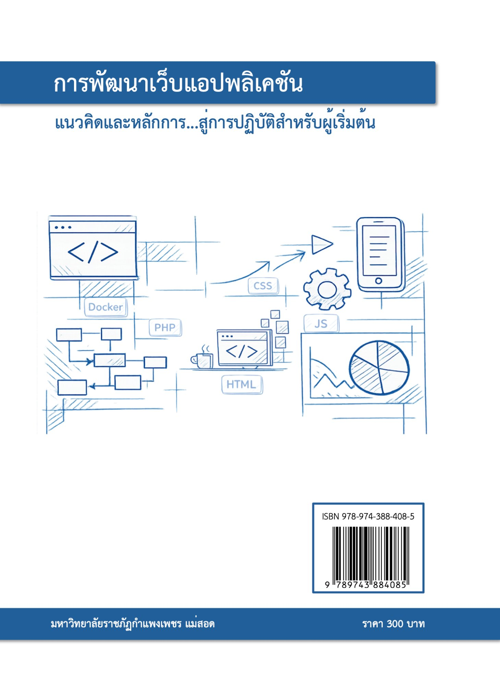

<p align="center">
  
  
</p>

# การพัฒนาเว็บแอปพลิเคชัน: แนวคิดและหลักการ...สู่การปฏิบัติสำหรับผู้เริ่มต้น

Repository นี้จัดทำขึ้นเพื่อรวบรวมรหัสคำสั่งตัวอย่างประกอบหนังสือ  
**“การพัฒนาเว็บแอปพลิเคชัน: แนวคิดและหลักการ...สู่การปฏิบัติสำหรับผู้เริ่มต้น”**

เนื้อหาใน Repository นี้มีวัตถุประสงค์เพื่อใช้ในการศึกษา ทดลอง และฝึกปฏิบัติด้านการพัฒนาเว็บแอปพลิเคชัน โดยจัดเรียงตัวอย่างให้สอดคล้องกับบทต่าง ๆ ภายในหนังสือ

## รายละเอียด Repository

Repository: `ajnok/book-web-application`

เนื้อหาหลักประกอบด้วยตัวอย่างรหัสคำสั่งที่เกี่ยวข้องกับการพัฒนาเว็บแอปพลิเคชัน เช่น HTML, CSS, JavaScript, PHP, การทำงานกับฐานข้อมูล และกรณีศึกษาที่เกี่ยวข้องกับการพัฒนาเว็บแอปพลิเคชันสำหรับผู้เริ่มต้น

## วัตถุประสงค์

Repository นี้จัดทำขึ้นเพื่อ

1. เป็นแหล่งดาวน์โหลดรหัสคำสั่งตัวอย่างประกอบหนังสือ
2. ช่วยให้ผู้อ่านสามารถทดลองรหัสคำสั่งได้ด้วยตนเอง
3. สนับสนุนการเรียนรู้จากแนวคิดพื้นฐานไปสู่การปฏิบัติ
4. ใช้เป็นสื่อประกอบการเรียนการสอนด้านการพัฒนาเว็บแอปพลิเคชัน

## โครงสร้างไฟล์

หนังสือแบ่งเนื้อหาออกเป็น 4 ส่วน 12 บท โดยบทที่ 1-2 เป็นเนื้อหาเชิงแนวคิด ไม่มีโค้ดตัวอย่างให้ฝึกปฏิบัติ จึงไม่มีโฟลเดอร์สำหรับสองบทนี้ใน Repository เนื้อหาที่ดึงมาเป็นไฟล์โค้ดจะเริ่มตั้งแต่บทที่ 3 เป็นต้นไป โดยจัดโครงสร้างดังนี้

```text
book-web-application/
├── assets/
│   ├── cover-front.jpg
│   └── cover-back.jpg
├── chapter-03-web-environment-xampp/
│   └── activities/
├── chapter-04-docker-virtualization/
│   ├── 03-lamp-stack-case-study/
│   └── activities/
├── chapter-05-html/
│   ├── 02-html-syntax/
│   ├── 03-default-display/
│   ├── 04-html-structure/
│   ├── 05-comments/
│   └── activities/
├── chapter-06-html-common-tags/
│   ├── 01-image-tags/
│   ├── 02-link-tags/
│   ├── 03-list-tags/
│   ├── 04-heading-text-tags/
│   ├── 05-table-tags/
│   ├── 06-form-tags/
│   ├── 07-non-semantic-grouping/
│   ├── 08-semantic-grouping/
│   └── activities/
├── chapter-07-css/
│   ├── 02-css-syntax/
│   ├── 03-using-css-with-html/
│   ├── 04-colors-and-units/
│   └── activities/
├── chapter-08-css-layout-bootstrap/
│   ├── 01-css-properties-basics/
│   ├── 02-flexbox-and-grid/
│   ├── 04-bootstrap-components/
│   └── activities/
├── chapter-09-javascript/
│   ├── 02-javascript-elements/
│   ├── 03-data-types/
│   ├── 04-control-structures/
│   └── activities/
├── chapter-10-javascript-dom/
│   ├── 01-functions/
│   ├── 02-objects/
│   ├── 03-arrays/
│   ├── 04-dom-manipulation/
│   └── activities/
├── chapter-11-php/
│   ├── 02-php-syntax/
│   ├── 03-variables-data-types/
│   ├── 04-echo-print/
│   ├── 05-control-structures/
│   ├── 06-functions-arrays/
│   └── activities/
├── chapter-12-php-crud/
│   ├── 01-form-handling/
│   ├── 02-database-connection/
│   ├── 03-crud-system/
│   └── activities/
├── .gitignore
├── LICENSE
└── README.md
```

หมายเหตุ:

- โฟลเดอร์ย่อยในแต่ละบทจะสร้างเฉพาะหัวข้อที่มีโค้ดตัวอย่างจริงในหนังสือเท่านั้น หัวข้อที่เป็นเนื้อหาอธิบายล้วน (ไม่มีโค้ด) จะไม่มีโฟลเดอร์ให้ หากพบว่าเนื้อหาจริงมีโค้ดเพิ่มเติมนอกเหนือจากที่ระบุไว้ โครงสร้างนี้อาจปรับปรุงเพิ่มเติมและจะระบุไว้ในแต่ละ Pull Request
- ไฟล์โค้ดในแต่ละหัวข้อตั้งชื่อในรูปแบบ `example-<เลขตัวอย่างในหนังสือ>-<คำอธิบายสั้นภาษาอังกฤษ>.<นามสกุลไฟล์>` และมีไฟล์ `README.md` กำกับในแต่ละโฟลเดอร์ เป็นตารางอ้างอิงกลับไปยังเลขตัวอย่างและเลขหน้าในหนังสือ
- โฟลเดอร์ `activities/` ในแต่ละบท เก็บคำถามและกิจกรรมท้ายบทตามที่ปรากฏในหนังสือ
- โค้ดทุกไฟล์คัดลอกตรงจากหนังสือ ไม่มีการแก้ไข ปรับปรุง หรือเพิ่มเติมใดๆ ทั้งสิ้น หากตัวอย่างใดเป็นเพียง code fragment ที่ไม่ใช่เอกสารสมบูรณ์ จะระบุไว้ใน README ของหัวข้อนั้น

## การใช้งาน

ผู้อ่านสามารถดาวน์โหลดหรือ Clone Repository นี้ได้ด้วยคำสั่ง

```bash
git clone https://github.com/ajnok/book-web-application.git
```

จากนั้นเปิดไฟล์ตัวอย่างตามบทหรือหัวข้อที่ต้องการศึกษา และทดลองรันด้วยเครื่องมือที่เหมาะสม เช่น Web Browser, Code Editor, Local Web Server หรือสภาพแวดล้อมสำหรับพัฒนาเว็บแอปพลิเคชัน

## License

รหัสคำสั่งตัวอย่างใน Repository นี้เผยแพร่ภายใต้ **MIT License**

ผู้อ่านสามารถนำรหัสคำสั่งตัวอย่างไปใช้ ศึกษา ดัดแปลง และประยุกต์ใช้ได้ตามเงื่อนไขของ MIT License

อย่างไรก็ตาม **เนื้อหาหนังสือ คำอธิบาย ภาพประกอบ แผนภาพ ภาพหน้าจอ แบบฝึกหัด และสื่อการสอนที่เกี่ยวข้อง** ถือเป็นลิขสิทธิ์ของผู้เขียน และไม่ได้อยู่ภายใต้ MIT License เว้นแต่จะมีการระบุไว้เป็นอย่างอื่น

## Author

Eakkarath Panyathep  
Digital Business Technology Program  
Kamphaeng Phet Rajabhat University, Mae Sot Campus
